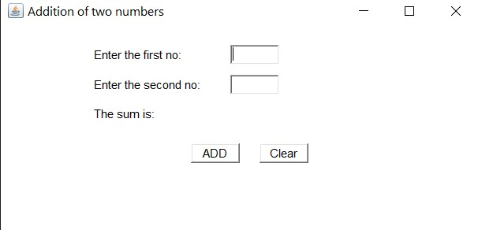

# First-AWT-Program

<h2> Screenshots </h2>  

 

This Program can Add two Numbers. It is my GUI based First Java Program. 

If your system have installed Java then you can Simply download the repo and then double click on Jar file to run the program. 
